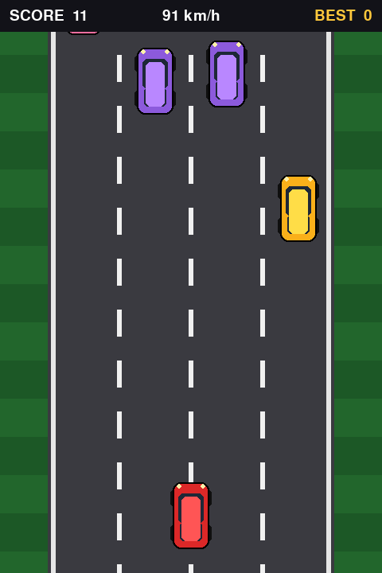

# Car-Game-Repo 🏎️

A car racing game built with Python and **pygame**. Currently shipping
**Highway Dash** — a top-down endless highway racer where you weave through
ever-faster traffic.



## Quick start

```bash
pip install -r requirements.txt
python main.py
```

## Controls

| Key                     | Action              |
| ----------------------- | ------------------- |
| ← / → (or A / D)        | Steer left / right  |
| ↑ (or W)                | Boost               |
| ↓ (or S)                | Brake               |
| SPACE                   | Start / restart     |
| ESC                     | Quit                |

## Gameplay

- Dodge slower traffic on a 4-lane highway; the road speeds up over time.
- Score grows with distance travelled, with a **+25 bonus per car overtaken**.
- Your best score is saved locally in `highscore.json`.

## Project layout

```
main.py            # entry point, game states, loop
game/settings.py   # all tunables (speeds, colors, sizes)
game/sprites.py    # player, traffic cars, scrolling road
requirements.txt
```

## Roadmap

- [x] Highway Dash mode (top-down traffic racer)
- [ ] Track racing mode (circuit with lap timer)
- [ ] Sound effects & music
- [ ] More cars / cosmetics
